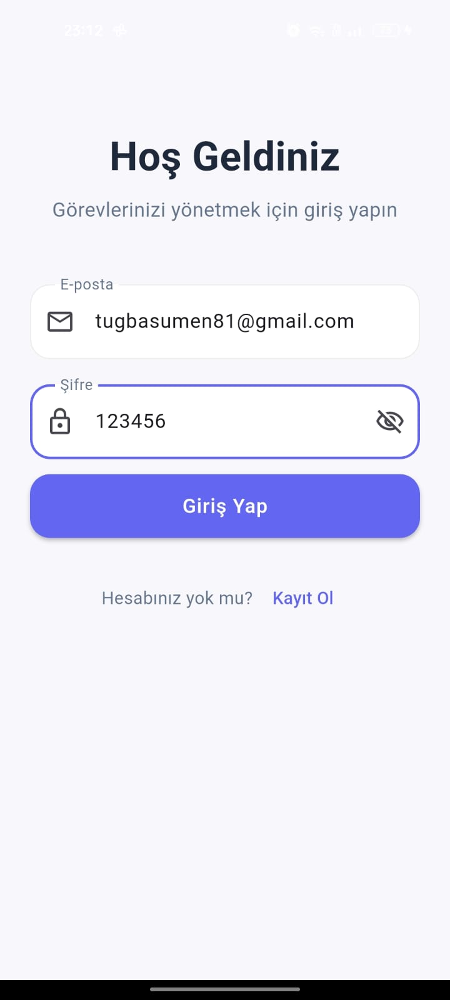
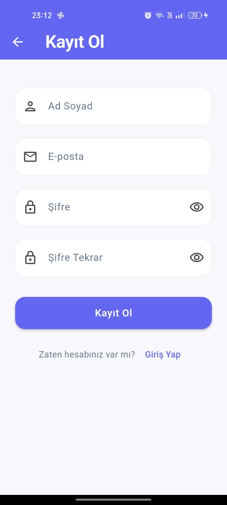
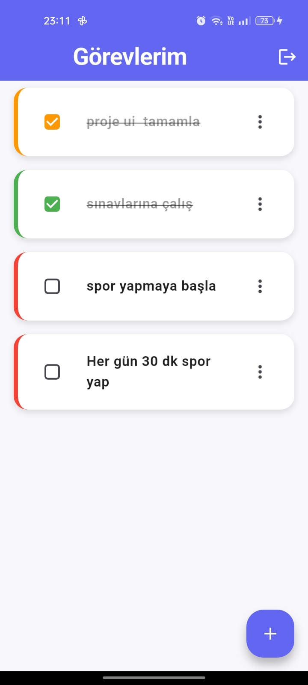
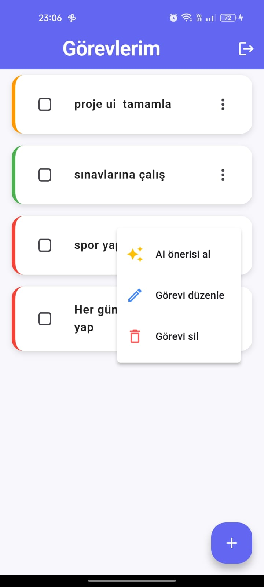
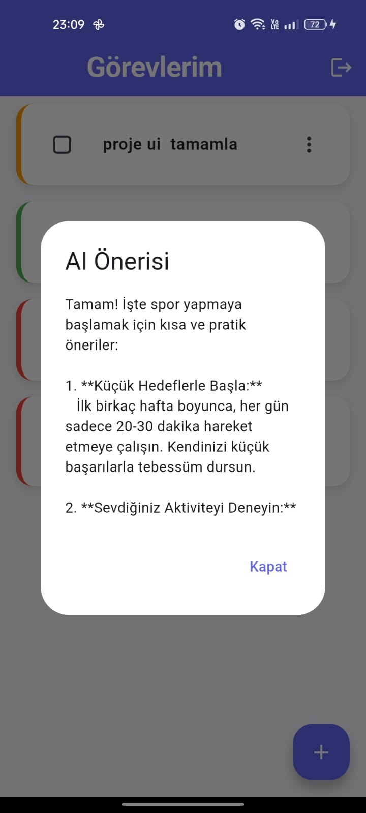
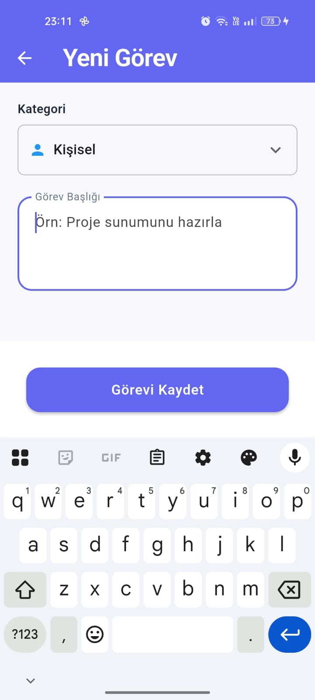
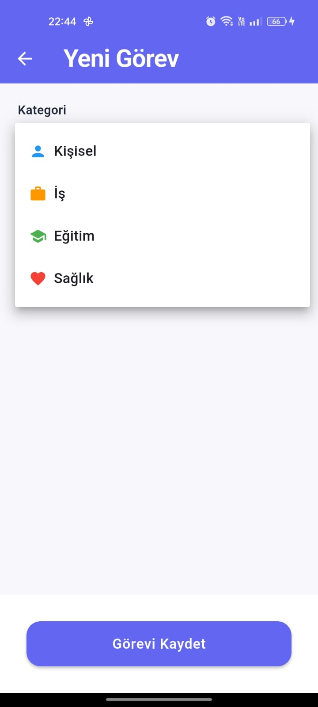
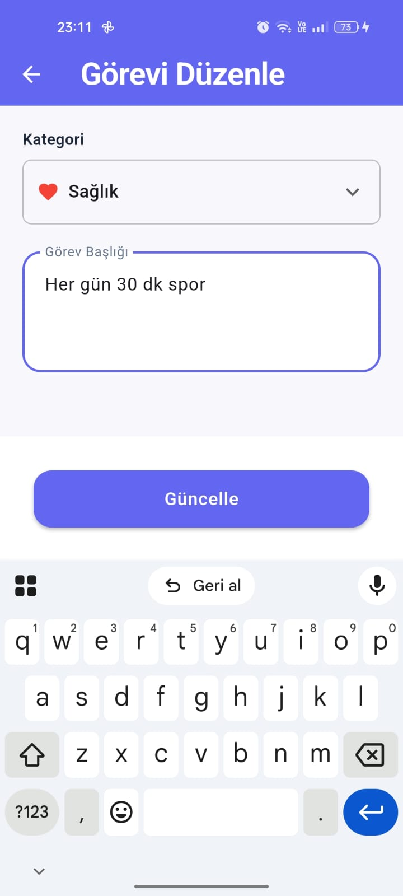
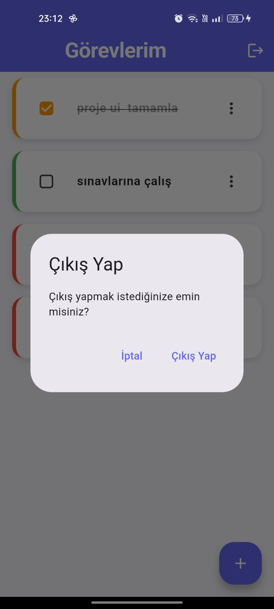
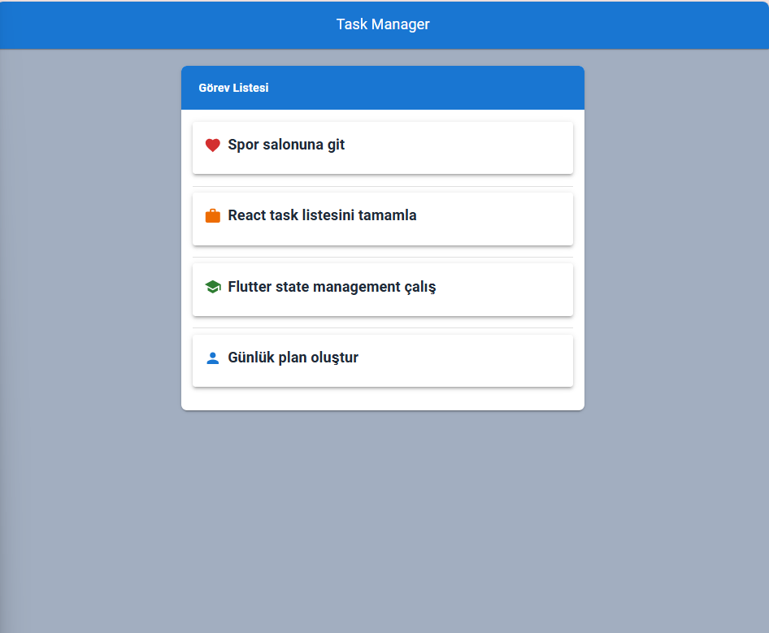

# 📝 AI-Powered Task Manager

**AI-Powered Task Manager**, modern yazılım mimarisi prensipleri kullanılarak geliştirilmiş hibrit bir görev yönetim platformudur.  
Kullanıcılar görevlerini kategori bazlı organize edebilir, tüm cihazlarda **bulut senkronizasyonu** ile takip edebilir ve **DeepSeek AI** ile akıllı görev önerileri alabilir.

---

## 🏗️ Mimari Yaklaşım

Proje, sürdürülebilirlik ve test edilebilirlik odaklı olarak **Katmanlı Mimari (Layered Architecture)** ve **MVVM (Model-View-ViewModel)** desenleri üzerine inşa edilmiştir.

### Flutter (Mobil) Mimarisi

* **View:** Sadece UI çizimi ve kullanıcı etkileşiminden sorumludur. İş mantığı içermez.
* **ViewModel:** `ChangeNotifier` ve `Provider` ile state yönetimi sağlar; UI ile servisler arasındaki köprü görevini görür.
* **Service Layer:** `Firebase Auth`, `Firestore` ve `DeepSeek API` iletişimini soyutlar.
* **Core:** Hata yönetimi (`AppException`), sabitler ve tema tanımlarını içerir.

### React (Web) Mimarisi

* **Component-Based:** Modüler ve tekrar kullanılabilir bileşenler.
* **Custom Hooks:** `useTasks` hook’u ile iş mantığı UI’dan ayrılmıştır.

---

## 📱 Mobil Uygulama (Flutter / Dart)

* Cross-platform mobil uygulama geliştirme
* `Provider` ile reaktif state yönetimi
* `Firebase Auth` ve `Firestore` entegrasyonu
* Modern Material 3 arayüz ve kategori bazlı renk kodlaması

## 💻 Web Uygulaması (React + Vite)

* Hızlı ve modüler frontend geliştirme
* Material 3 / MUI ile modern UI bileşenleri
* Custom Hooks (`useTasks`) ile iş mantığını UI’dan ayırma

---

## ⚙️ Backend ve AI

* **Firebase:** Kullanıcı kimlik doğrulama ve real-time NoSQL veri tabanı
* **DeepSeek AI:** Görev başlıklarına göre akıllı öneriler (Flask API üzerinden)
* **Diğer:** `http`, `requests` gibi kütüphaneler ile API iletişimi

---

## ⚙️ Kurulum ve Çalıştırma

### 1️⃣ Ön Hazırlık

* Flutter SDK (>= 3.10)
* Node.js (>= 18)
* Python (>= 3.10)

3️⃣ Web Uygulaması
cd web-app
npm install
npm run dev

4️⃣ AI Backend (Flask)
cd ai_backend
pip install -r requirements.txt
python api.py

Not: AI backend, DeepSeek modeline lokal veya servis üzerinden bağlanır. Endpoint aktif değilse öneri özelliği çalışmaz.

## 📸 Ekran Görüntüleri

### Mobil Uygulama
  
  
  
  
  
  
  
  
  

### Web Uygulaması

🚀 Öne Çıkan Özellikler

🔍 AI Suggestions: Görev başlığına göre DeepSeek modeli üzerinden stratejik öneriler sunar.

🔄 Real-time Sync: Firestore Stream’leri ile cihazlar arası anlık veri senkronizasyonu.

🛡️ Robust Error Handling: Merkezi exception mapping ile kullanıcıya anlamlı geri bildirimler sağlar.

🎨 Dynamic Theming: Material 3 standartlarında, kategori bazlı renk kodlamalı arayüz.

⏳ Gelecek Planları

Unit Tests: ViewModel ve Service katmanları için %80+ test kapsamı

CI/CD: GitHub Actions ile otomatik build ve Firebase App Distribution entegrasyonu

Offline Mode: Hive veya Sqflite kullanarak çevrimdışı veri desteği ve senkronizasyon

Security: API katmanı için JWT tabanlı yetkilendirme ve rate-limiting
